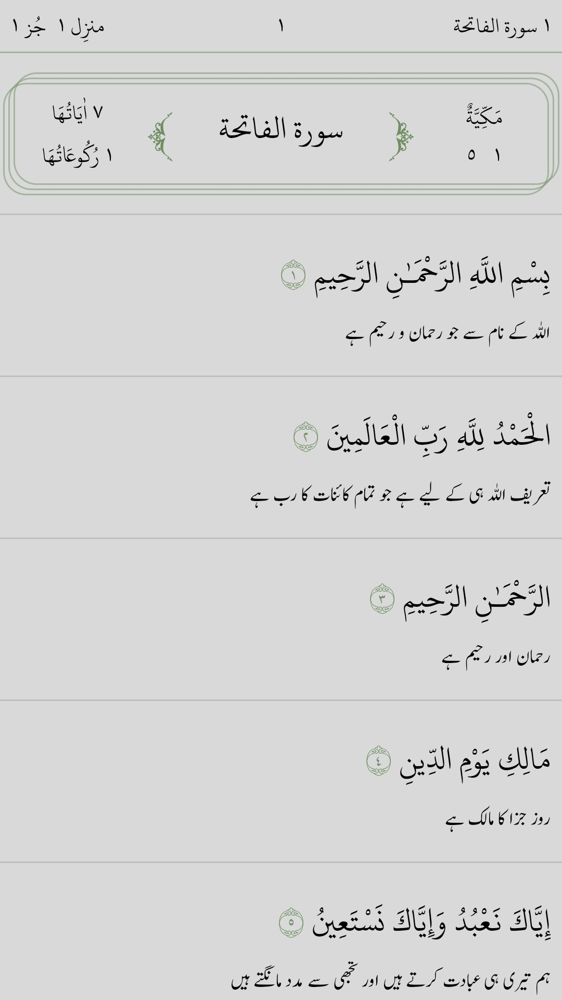
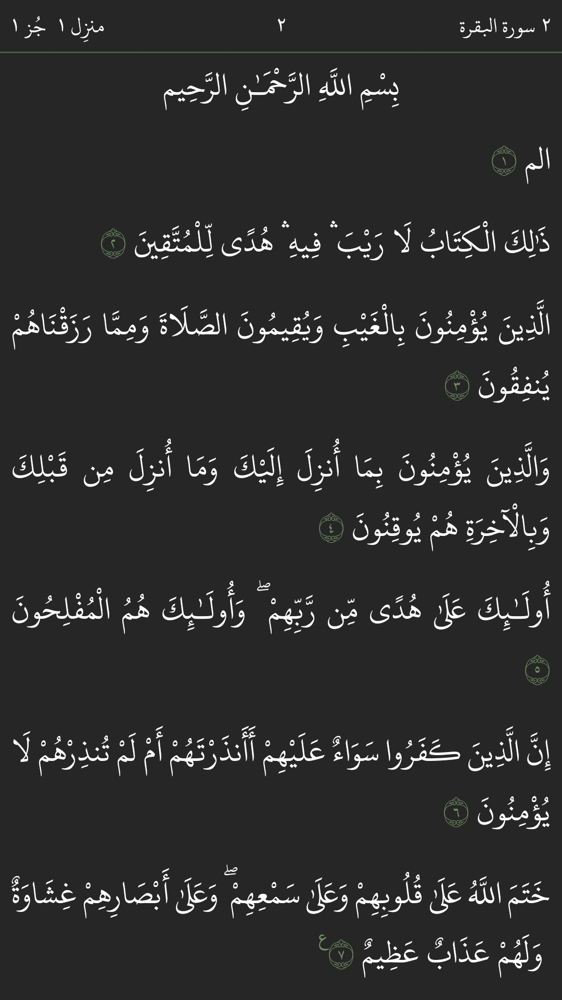
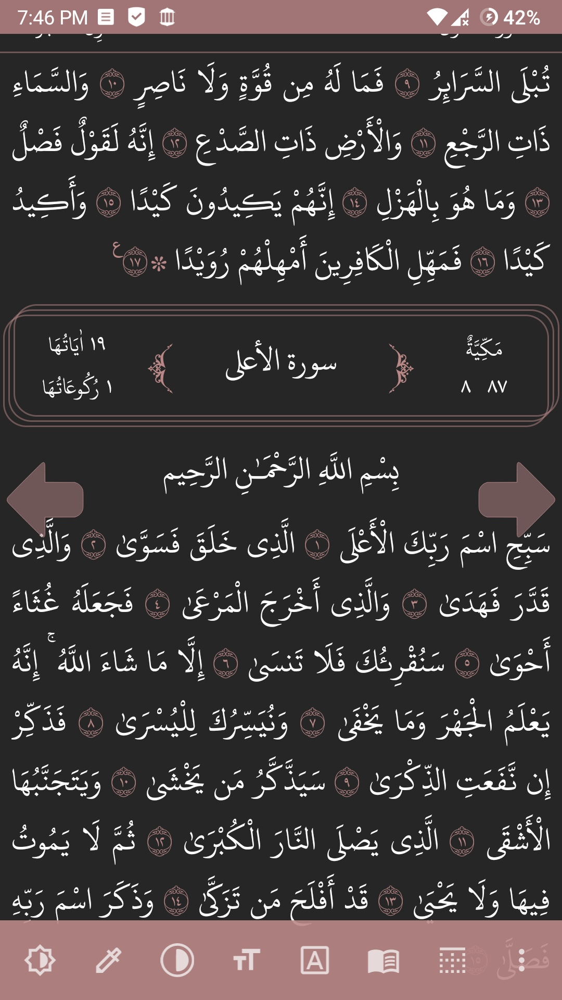
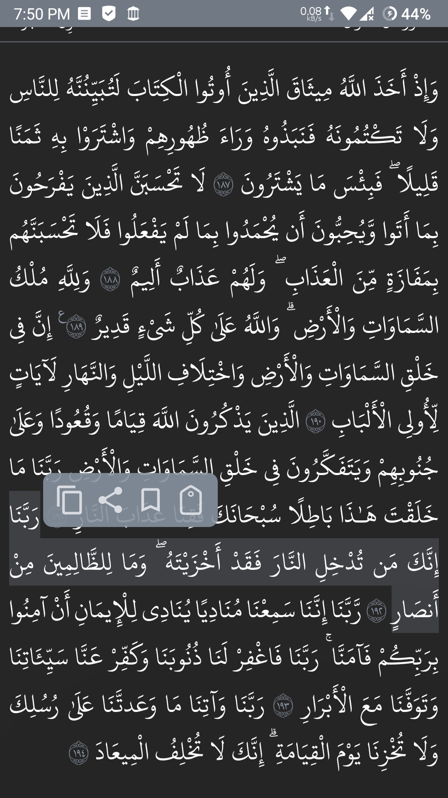
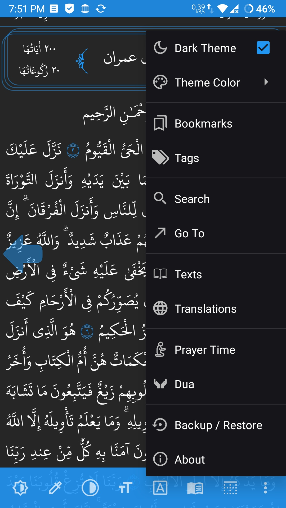
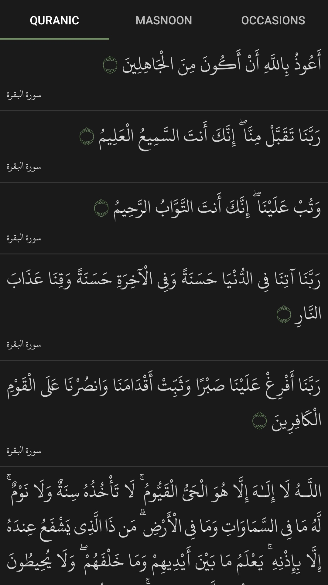
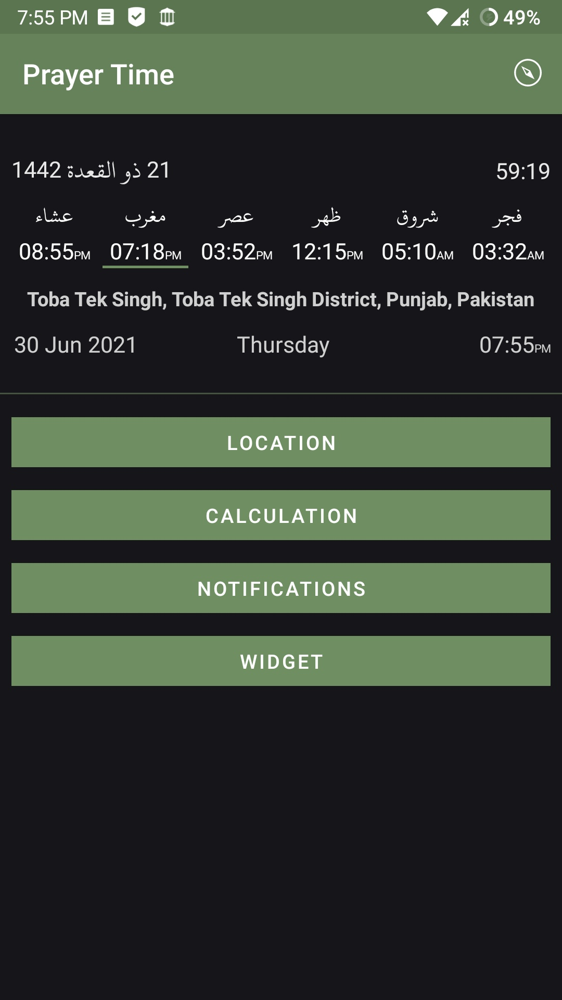

# NoorUlHuda
Noor-Ul-Huda is an offline Quran app with Prayer Time and Duas (supplications), made with ❤️ and تقوٰى.

   

* Join [Telegram support group](https://t.me/NoorUlHudaApp/) to get instant updates and test beta releases.

## Features
Customize your reading experience the way you want:

* Choose Quranic <b>script</b>: Imla'ei or Uthmani
* Choose from different Arabic <b>fonts</b>, adjust font contrast and <b>size</b>
* Set comfortable <b>background tone</b> and screen brightness
* Choose from <b>Page Mode</b> or continuous reading
* <b>Dark theme</b> and multiple theme colors supported

Make Quran reading more profitable:

* <b>Translations</b> in different languages.
* Quickly take notes by creating <b>Tags</b> with Title and Description.
* Conveniently tag Āyahs by long pressing.
* <b>Search</b> in Quranic text or translations.
* <b>Share</b> or copy Āyahs (with translation) by long pressing.

Easy navigation:

* <b>Bookmark</b> Āyahs by long pressing.
* Go to desired page, Surah, Juz or Manzil.

More:

* Quranic and Masnoon Supplications (<b>Duas</b>), general and for special occasions.
* <b>Prayer Time</b> notifications and Adhan, and <b>Qibla</b> direction for set location.
* <b>Backup and Restore</b> preferences, Tags and Bookmarks.

## Required Permissions

* **INTERNET** permission is required to check for updates, download Quranic texts and translations, fonts and Adhan audio file, and for (reverse) geocoding.

  If you do not use any of these features, NUH makes no connection to internet, ever. Once a required resource is downloaded (with your approval), the app functions completely offline. The domains NUH may connect to include https://github.com, https://mirfatif.github.io and https://www.geonames.org.
* **FOREGROUND_SERVICE** permission is required to show persistent widget notification and play Adhan.
* **WAKE_LOCK** is required to play Adhan alarm.
* **RECEIVE_BOOT_COMPLETED** is required to reset alarms (for Prayer notifications and Adhan) when device is restarted.

## Privacy Policy

[Privacy Policy](https://mirfatif.github.io/NoorUlHuda/PRIVACY.html)

## Screenshots

  
  

## Translations 
[Crowdin](https://crowdin.com/project/nuh)

## Third-Party Resources

**Libraries:**

* [Android Jetpack](https://github.com/androidx/androidx)
* [Material Components for Android](https://github.com/material-components/material-components-android)
* [Adhan Java](https://github.com/batoulapps/adhan-java)
* [Time4A](https://github.com/batoulapps/adhan-java)
* [BetterLinkMovementMethod](https://github.com/saket/Better-Link-Movement-Method)
* [LeakCanary](https://github.com/square/leakcanary)
* [Google Java Format](https://github.com/sherter/google-java-format-gradle-plugin)
* [Guava](https://github.com/google/guava)

**Quranic Texts and Translations:**

Noor Ul Huda uses Quranic texts and translations provided by <a href="https://tanzil.net/download">Tanzil Project</a>. To know about the accuracy of the Quranic text and keep track of any changes, and for help on text types, pause marks and other topics, please visit [Tanzil Documents](https://tanzil.net/docs/).

**Fonts:**

Noor Ul Huda uses Arabic fonts created by:
      
* <a href="https://fonts.qurancomplex.gov.sa">King Fahd Quran Complex</a>
* <a href="https://pakdata.com/products/arabicfont">Pakistan Data Management Services</a>
* <a href="https://software.sil.org/arabicfonts">SIL International</a>
* <a href="https://www.noorehidayat.org">Noor-e-Hidayat</a>
* <a href="https://github.com/icikiwir/me_quran">Meor Ridzuan</a>
* <a href="https://github.com/quranacademy/kitab-font">Quran Academy</a>

**Adhan:**

* Qari Islam Sobhi

## License 

You **CANNOT** use and distribute the app icon in anyway, except for **Noor Ul Huda** (`com.mirfatif.noorulhuda`) app.

    Noor Ul Huda is free software: you can redistribute it and/or modify
    it under the terms of the Affero GNU General Public License as published by
    the Free Software Foundation, either version 3 of the License, or
    (at your option) any later version.

    This program is distributed in the hope that it will be useful,
    but WITHOUT ANY WARRANTY; without even the implied warranty of
    MERCHANTABILITY or FITNESS FOR A PARTICULAR PURPOSE.  See the
    Affero GNU General Public License for more details.

    You should have received a copy of the Affero GNU General Public License
    along with this program.  If not, see <https://www.gnu.org/licenses/>.

## Support Us

Remember in your special prayers.

## Contact Us

**Telegram:** [https://t.me/NoorUlHudaApp](https://t.me/NoorUlHudaApp)  
**XDA Thread:** [https://forum.xda-developers.com...](https://forum.xda-developers.com/t/app-7-0-noor-ul-huda-nur-alxd-quran-reader-prayer-time-and-duas-app.4306203/)  
**Email:** [mirfatif.dev@gmail.com](mailto:mirfatif.dev@gmail.com)
